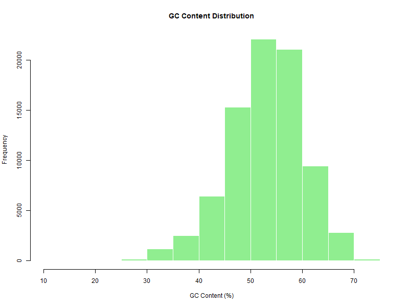
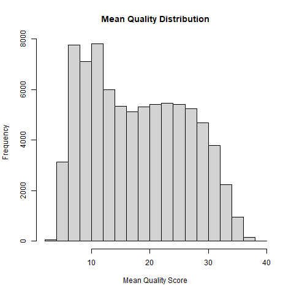

# Snakemake Pipeline for Long-Read FASTQ Analysis
#Project Description
This project provides a reproducible Snakemake pipeline for basic quality control of long-read sequencing data stored in FASTQ format. FASTQ files contain a large number of read sequences and their quality scores which indicate how reliably each base is read. Because sequencing experiment may introduce errors, bias, technical problems, quality control is important before downstream analyses. The pipeline processes FASTQ file, calculates three read-level metrics for each reads: read length, GC content and mean quality score. The workflow is provided as an automated pipeline using Snakemake, where Python script reads FASTQ file and gives read-level statistics. The calculated values are written to CSV file and the distributions of metrics are visualized using plots. This allows a quick assessment of sequencing data quality. The workflow is provided using Snakemake and runs within a Conda environment defined in the repository, ensuring reproducibility and consistent software dependencies. Read length represents the number of nucleotides contained in each sequencing read. The distribution of the read lengths give information about structure of the dataset and sequencing performance. GC content represents the proportion of guanine (G) and cytosine (C) bases within a sequencing read. The potential sequencing bias or contamination can be detected by GC content distribution, since different organisms often have characteristic GC content patterns. This metric helps determine whether dataset shows unexpected deviation from typical GC distribution. The mean quality score represents the values derived from the quality scores in FASTQ file and indicate how reliable the base calls are. The distribution of mean quality score helps evaluate the reliability of sequencing data. 

#Input Data
The pipeline takes a FASTQ file as input. FASTQ files contain sequencing reads with their quality scores for each base.

#Pipeline Tools
Python
Snakemake
Conda

#Workflow Steps
FASTQ file
↓
Python script reads sequencing data
↓
Read-level statistics are calculated (read length, GC content, mean quality score)
↓
Statistics are written to a CSV file
↓
Summary statistics are generated
↓
Distributions of metrics are visualized using plots

#Output Files
The pipeline produces output files that summarize the sequencing dataset:

summary_stats.csv
Contains summary statistics describing the dataset based on calculated read-level metrics.

read_length_hist.png
Histogram representing the distribution of read lengths across the dataset.

gc_content_hist.png
Histogram representing the distribution of GC content among sequencing reads.

mean_quality_hist.png
Histogram representing the distribution of mean read quality scores.

These outputs provide a quick overview of sequencing data quality and dataset characteristics.

#Plots
## Read Length Distribution

## GC Content Distribution

## Mean Quality Score Distribution

#Environment
The pipeline is generated using Snakemake and runs within a Conda environment defined in the environment.yml file. This environment specifies necessary software dependencies and ensures that the analysis can be reproduced across different systems.

#How To Run
To run the pipeline:
Clone the repository
Create the Conda environment
Execute the Snakemake workflow

Commands:
conda env create -f environment.yml
conda activate casestudy_pipeline_env
snakemake --cores 1

#Repository Structure
casestudy_pipeline/
│
├── data/
│   └── barcode77.fastq
│
├── workflow/
│   └── Snakefile
│
├── scripts/
│   └── read_stats.py
│
├── results/
│   ├── summary_stats.csv
│   ├── read_length_hist.png
│   ├── gc_content_hist.png
│   └── mean_quality_hist.png
│
├── environment.yml
└── README.md

#Notes
The full read-level statistics file (read_stats.csv) is not included in the repository due to its large size. This file is generated automatically when the pipeline is executed.
